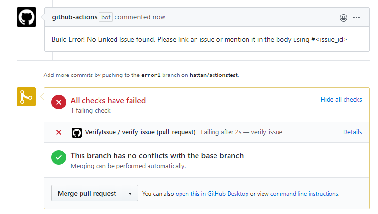
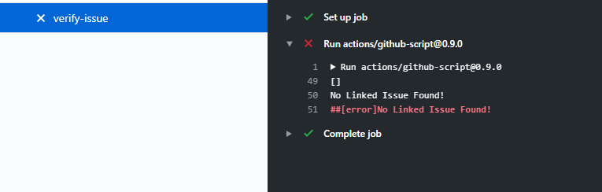

# Verify Linked Issue Action
A GitHub action that verifies your pull request contains a reference to an issue. 

For now this is impleted as a [workflow with a script](example/verify-issue.yml) using [github-script](https://github.com/actions/github-script), but will soon be converted to a full fledged action.

On a PR that does not include a linked issue or reference to an issue in the body, the check should fail and a comment will be added to the PR.

## Installation

* Ensure you have the folder .github/workflow
* In .github/workflow place the [verify-issue.yml](example/verify-issue.yml) workflow.

## Trying it out

* Create a new pull request and take care to not include a linked item or mention an issue.
* The build should fail.

## Known Issues

* Adding an issue or updating the PR body does not re-trigger a check, you need to go into the run and re-run the job.

* There must be a space after the issue number (ie "#12 " not "#12".) This is due to the way the RegEx is structured and will be resolved in a future release.

* The Issue reference by # needs to be in the body, we don't currently look in the title. That is a future enhancement.

